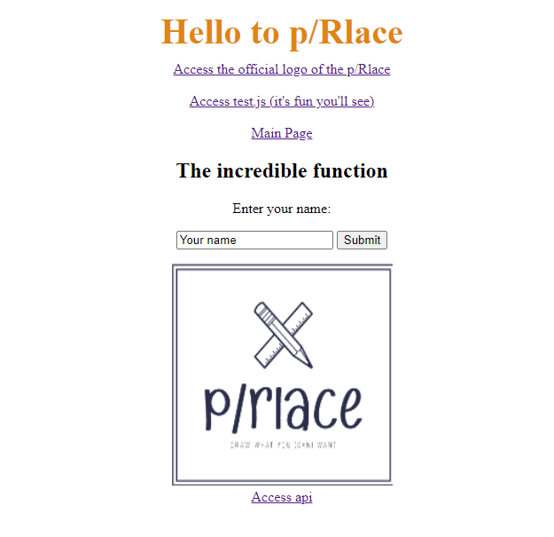

# Advanced Web Programming
> When you put it all together and run your server, then visit your site in a browser, you should see a site, which uses other static files as normal.  That site should include UI and front-end Javascript which triggers an AJAX request, in at least two different ways.  
> Using that UI should result in different responses from your dynamic endpoint.

## General Information
- Assignment 2

## Screenshot

## How to start server
`npm run start` or `nodemon index.js`

## Acknowledgements
- Thanks to vincent for helping me with setting up the server
